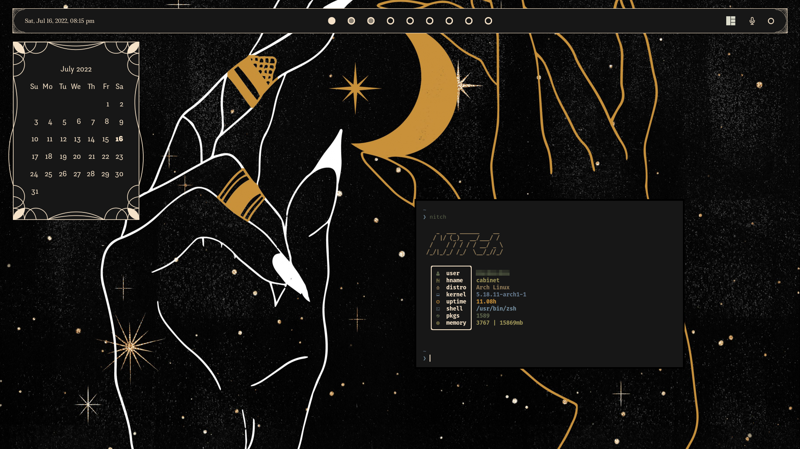

# Dotfiles

Personal collection of dotfiles, will change periodically as I get bored.

# My Setup
- **WM**          _AwesomeWM_
- **OS**           _Arch Linux_
- **Shell**         _zsh_
- **Terminal**      _kitty_
- **Editor**        _Neovim_
- **File Manager**  _Nautilus_
- **Launcher**     _rofi_

# Extra Requirements
- NERD font
- Sway (for greetd to run)

# Caveats
- Notifications are a little weird (they don't stack or disappear correctly)
- You'll have to make sure picom runs at start
